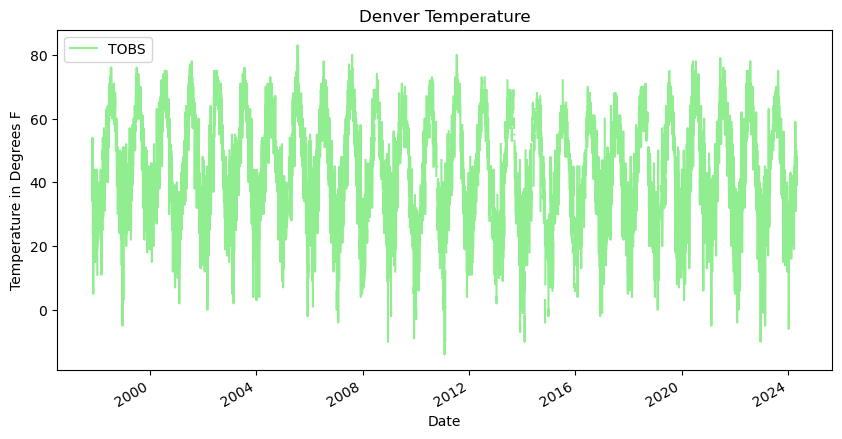
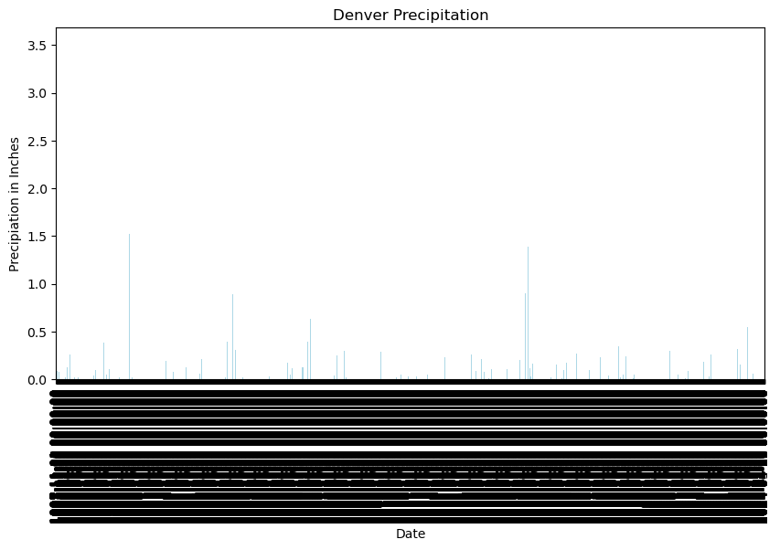

## Denver Colorado Weather Analysis
words and sentences


```python
# Import pandas
import pandas as pd
```


```python
# Data for Denver Colorado

ncei_url = (
    'https://www.ncei.noaa.gov/access/services/data/v1'
    '?dataset=daily-summaries'
    '&dataTypes=TOBS,PRCP'
    '&stations=USC00052223'
    '&startDate=1949-10-01'
    '&endDate=2024-05-03'
    '&includeStationName=true'
    '&includeStationLocation=1'
    '&units=standard')
ncei_url
```


    'https://www.ncei.noaa.gov/access/services/data/v1?dataset=daily-summaries&dataTypes=TOBS,PRCP&stations=USC00052223&startDate=1949-10-01&endDate=2024-05-03&includeStationName=true&includeStationLocation=1&units=standard'


```python
# creating data frame for denver
denver_df = pd.read_csv(
  ncei_url,
  index_col='DATE',
  parse_dates=True,
  na_values=['NaN'])
denver_df
```


<div>
<style scoped>
    .dataframe tbody tr th:only-of-type {
        vertical-align: middle;
    }

    .dataframe tbody tr th {
        vertical-align: top;
    }

    .dataframe thead th {
        text-align: right;
    }
</style>
<table border="1" class="dataframe">
  <thead>
    <tr style="text-align: right;">
      <th></th>
      <th>STATION</th>
      <th>NAME</th>
      <th>LATITUDE</th>
      <th>LONGITUDE</th>
      <th>ELEVATION</th>
      <th>PRCP</th>
      <th>TOBS</th>
    </tr>
    <tr>
      <th>DATE</th>
      <th></th>
      <th></th>
      <th></th>
      <th></th>
      <th></th>
      <th></th>
      <th></th>
    </tr>
  </thead>
  <tbody>
    <tr>
      <th>1997-11-01</th>
      <td>USC00052223</td>
      <td>DENVER WATER DEPARTMENT, CO US</td>
      <td>39.72944</td>
      <td>-105.00861</td>
      <td>1592.6</td>
      <td>0.00</td>
      <td>42.0</td>
    </tr>
    <tr>
      <th>1997-11-02</th>
      <td>USC00052223</td>
      <td>DENVER WATER DEPARTMENT, CO US</td>
      <td>39.72944</td>
      <td>-105.00861</td>
      <td>1592.6</td>
      <td>0.00</td>
      <td>38.0</td>
    </tr>
    <tr>
      <th>1997-11-03</th>
      <td>USC00052223</td>
      <td>DENVER WATER DEPARTMENT, CO US</td>
      <td>39.72944</td>
      <td>-105.00861</td>
      <td>1592.6</td>
      <td>0.00</td>
      <td>35.0</td>
    </tr>
    <tr>
      <th>1997-11-04</th>
      <td>USC00052223</td>
      <td>DENVER WATER DEPARTMENT, CO US</td>
      <td>39.72944</td>
      <td>-105.00861</td>
      <td>1592.6</td>
      <td>0.00</td>
      <td>54.0</td>
    </tr>
    <tr>
      <th>1997-11-05</th>
      <td>USC00052223</td>
      <td>DENVER WATER DEPARTMENT, CO US</td>
      <td>39.72944</td>
      <td>-105.00861</td>
      <td>1592.6</td>
      <td>0.00</td>
      <td>34.0</td>
    </tr>
    <tr>
      <th>...</th>
      <td>...</td>
      <td>...</td>
      <td>...</td>
      <td>...</td>
      <td>...</td>
      <td>...</td>
      <td>...</td>
    </tr>
    <tr>
      <th>2024-04-27</th>
      <td>USC00052223</td>
      <td>DENVER WATER DEPARTMENT, CO US</td>
      <td>39.72944</td>
      <td>-105.00861</td>
      <td>1592.6</td>
      <td>0.74</td>
      <td>41.0</td>
    </tr>
    <tr>
      <th>2024-04-28</th>
      <td>USC00052223</td>
      <td>DENVER WATER DEPARTMENT, CO US</td>
      <td>39.72944</td>
      <td>-105.00861</td>
      <td>1592.6</td>
      <td>0.91</td>
      <td>39.0</td>
    </tr>
    <tr>
      <th>2024-04-29</th>
      <td>USC00052223</td>
      <td>DENVER WATER DEPARTMENT, CO US</td>
      <td>39.72944</td>
      <td>-105.00861</td>
      <td>1592.6</td>
      <td>0.00</td>
      <td>46.0</td>
    </tr>
    <tr>
      <th>2024-04-30</th>
      <td>USC00052223</td>
      <td>DENVER WATER DEPARTMENT, CO US</td>
      <td>39.72944</td>
      <td>-105.00861</td>
      <td>1592.6</td>
      <td>0.00</td>
      <td>48.0</td>
    </tr>
    <tr>
      <th>2024-05-03</th>
      <td>USC00052223</td>
      <td>DENVER WATER DEPARTMENT, CO US</td>
      <td>39.72944</td>
      <td>-105.00861</td>
      <td>1592.6</td>
      <td>NaN</td>
      <td>46.0</td>
    </tr>
  </tbody>
</table>
<p>9574 rows × 7 columns</p>
</div>


```python
# Plot the data using .plot
denver_df.plot(
    y='TOBS',
    title='Denver Temperature',
    xlabel='Date',
    ylabel='Temperature in Degrees F',
    color='lightgreen',
    figsize=(10,5))
denver_df
```


<div>
<style scoped>
    .dataframe tbody tr th:only-of-type {
        vertical-align: middle;
    }

    .dataframe tbody tr th {
        vertical-align: top;
    }

    .dataframe thead th {
        text-align: right;
    }
</style>
<table border="1" class="dataframe">
  <thead>
    <tr style="text-align: right;">
      <th></th>
      <th>STATION</th>
      <th>NAME</th>
      <th>LATITUDE</th>
      <th>LONGITUDE</th>
      <th>ELEVATION</th>
      <th>PRCP</th>
      <th>TOBS</th>
    </tr>
    <tr>
      <th>DATE</th>
      <th></th>
      <th></th>
      <th></th>
      <th></th>
      <th></th>
      <th></th>
      <th></th>
    </tr>
  </thead>
  <tbody>
    <tr>
      <th>1997-11-01</th>
      <td>USC00052223</td>
      <td>DENVER WATER DEPARTMENT, CO US</td>
      <td>39.72944</td>
      <td>-105.00861</td>
      <td>1592.6</td>
      <td>0.00</td>
      <td>42.0</td>
    </tr>
    <tr>
      <th>1997-11-02</th>
      <td>USC00052223</td>
      <td>DENVER WATER DEPARTMENT, CO US</td>
      <td>39.72944</td>
      <td>-105.00861</td>
      <td>1592.6</td>
      <td>0.00</td>
      <td>38.0</td>
    </tr>
    <tr>
      <th>1997-11-03</th>
      <td>USC00052223</td>
      <td>DENVER WATER DEPARTMENT, CO US</td>
      <td>39.72944</td>
      <td>-105.00861</td>
      <td>1592.6</td>
      <td>0.00</td>
      <td>35.0</td>
    </tr>
    <tr>
      <th>1997-11-04</th>
      <td>USC00052223</td>
      <td>DENVER WATER DEPARTMENT, CO US</td>
      <td>39.72944</td>
      <td>-105.00861</td>
      <td>1592.6</td>
      <td>0.00</td>
      <td>54.0</td>
    </tr>
    <tr>
      <th>1997-11-05</th>
      <td>USC00052223</td>
      <td>DENVER WATER DEPARTMENT, CO US</td>
      <td>39.72944</td>
      <td>-105.00861</td>
      <td>1592.6</td>
      <td>0.00</td>
      <td>34.0</td>
    </tr>
    <tr>
      <th>...</th>
      <td>...</td>
      <td>...</td>
      <td>...</td>
      <td>...</td>
      <td>...</td>
      <td>...</td>
      <td>...</td>
    </tr>
    <tr>
      <th>2024-04-27</th>
      <td>USC00052223</td>
      <td>DENVER WATER DEPARTMENT, CO US</td>
      <td>39.72944</td>
      <td>-105.00861</td>
      <td>1592.6</td>
      <td>0.74</td>
      <td>41.0</td>
    </tr>
    <tr>
      <th>2024-04-28</th>
      <td>USC00052223</td>
      <td>DENVER WATER DEPARTMENT, CO US</td>
      <td>39.72944</td>
      <td>-105.00861</td>
      <td>1592.6</td>
      <td>0.91</td>
      <td>39.0</td>
    </tr>
    <tr>
      <th>2024-04-29</th>
      <td>USC00052223</td>
      <td>DENVER WATER DEPARTMENT, CO US</td>
      <td>39.72944</td>
      <td>-105.00861</td>
      <td>1592.6</td>
      <td>0.00</td>
      <td>46.0</td>
    </tr>
    <tr>
      <th>2024-04-30</th>
      <td>USC00052223</td>
      <td>DENVER WATER DEPARTMENT, CO US</td>
      <td>39.72944</td>
      <td>-105.00861</td>
      <td>1592.6</td>
      <td>0.00</td>
      <td>48.0</td>
    </tr>
    <tr>
      <th>2024-05-03</th>
      <td>USC00052223</td>
      <td>DENVER WATER DEPARTMENT, CO US</td>
      <td>39.72944</td>
      <td>-105.00861</td>
      <td>1592.6</td>
      <td>NaN</td>
      <td>46.0</td>
    </tr>
  </tbody>
</table>
<p>9574 rows × 7 columns</p>
</div>


    

    


```python
# Plot the data using .plot
denver_df.plot(
    y='PRCP',
    title='Denver Precipitation',
    xlabel='Date',
    ylabel='Precipiation in Inches',
    kind='bar',
    legend=False,
    color='lightblue',
    figsize=(10,5))
denver_df
```


<div>
<style scoped>
    .dataframe tbody tr th:only-of-type {
        vertical-align: middle;
    }

    .dataframe tbody tr th {
        vertical-align: top;
    }

    .dataframe thead th {
        text-align: right;
    }
</style>
<table border="1" class="dataframe">
  <thead>
    <tr style="text-align: right;">
      <th></th>
      <th>STATION</th>
      <th>NAME</th>
      <th>LATITUDE</th>
      <th>LONGITUDE</th>
      <th>ELEVATION</th>
      <th>PRCP</th>
      <th>TOBS</th>
    </tr>
    <tr>
      <th>DATE</th>
      <th></th>
      <th></th>
      <th></th>
      <th></th>
      <th></th>
      <th></th>
      <th></th>
    </tr>
  </thead>
  <tbody>
    <tr>
      <th>1997-11-01</th>
      <td>USC00052223</td>
      <td>DENVER WATER DEPARTMENT, CO US</td>
      <td>39.72944</td>
      <td>-105.00861</td>
      <td>1592.6</td>
      <td>0.00</td>
      <td>42.0</td>
    </tr>
    <tr>
      <th>1997-11-02</th>
      <td>USC00052223</td>
      <td>DENVER WATER DEPARTMENT, CO US</td>
      <td>39.72944</td>
      <td>-105.00861</td>
      <td>1592.6</td>
      <td>0.00</td>
      <td>38.0</td>
    </tr>
    <tr>
      <th>1997-11-03</th>
      <td>USC00052223</td>
      <td>DENVER WATER DEPARTMENT, CO US</td>
      <td>39.72944</td>
      <td>-105.00861</td>
      <td>1592.6</td>
      <td>0.00</td>
      <td>35.0</td>
    </tr>
    <tr>
      <th>1997-11-04</th>
      <td>USC00052223</td>
      <td>DENVER WATER DEPARTMENT, CO US</td>
      <td>39.72944</td>
      <td>-105.00861</td>
      <td>1592.6</td>
      <td>0.00</td>
      <td>54.0</td>
    </tr>
    <tr>
      <th>1997-11-05</th>
      <td>USC00052223</td>
      <td>DENVER WATER DEPARTMENT, CO US</td>
      <td>39.72944</td>
      <td>-105.00861</td>
      <td>1592.6</td>
      <td>0.00</td>
      <td>34.0</td>
    </tr>
    <tr>
      <th>...</th>
      <td>...</td>
      <td>...</td>
      <td>...</td>
      <td>...</td>
      <td>...</td>
      <td>...</td>
      <td>...</td>
    </tr>
    <tr>
      <th>2024-04-27</th>
      <td>USC00052223</td>
      <td>DENVER WATER DEPARTMENT, CO US</td>
      <td>39.72944</td>
      <td>-105.00861</td>
      <td>1592.6</td>
      <td>0.74</td>
      <td>41.0</td>
    </tr>
    <tr>
      <th>2024-04-28</th>
      <td>USC00052223</td>
      <td>DENVER WATER DEPARTMENT, CO US</td>
      <td>39.72944</td>
      <td>-105.00861</td>
      <td>1592.6</td>
      <td>0.91</td>
      <td>39.0</td>
    </tr>
    <tr>
      <th>2024-04-29</th>
      <td>USC00052223</td>
      <td>DENVER WATER DEPARTMENT, CO US</td>
      <td>39.72944</td>
      <td>-105.00861</td>
      <td>1592.6</td>
      <td>0.00</td>
      <td>46.0</td>
    </tr>
    <tr>
      <th>2024-04-30</th>
      <td>USC00052223</td>
      <td>DENVER WATER DEPARTMENT, CO US</td>
      <td>39.72944</td>
      <td>-105.00861</td>
      <td>1592.6</td>
      <td>0.00</td>
      <td>48.0</td>
    </tr>
    <tr>
      <th>2024-05-03</th>
      <td>USC00052223</td>
      <td>DENVER WATER DEPARTMENT, CO US</td>
      <td>39.72944</td>
      <td>-105.00861</td>
      <td>1592.6</td>
      <td>NaN</td>
      <td>46.0</td>
    </tr>
  </tbody>
</table>
<p>9574 rows × 7 columns</p>
</div>


    

    


```python
# Subset the data
denver_97_23 = denver_df['1997':'2023']
denver_97_23
```


<div>
<style scoped>
    .dataframe tbody tr th:only-of-type {
        vertical-align: middle;
    }

    .dataframe tbody tr th {
        vertical-align: top;
    }

    .dataframe thead th {
        text-align: right;
    }
</style>
<table border="1" class="dataframe">
  <thead>
    <tr style="text-align: right;">
      <th></th>
      <th>STATION</th>
      <th>NAME</th>
      <th>LATITUDE</th>
      <th>LONGITUDE</th>
      <th>ELEVATION</th>
      <th>PRCP</th>
      <th>TOBS</th>
    </tr>
    <tr>
      <th>DATE</th>
      <th></th>
      <th></th>
      <th></th>
      <th></th>
      <th></th>
      <th></th>
      <th></th>
    </tr>
  </thead>
  <tbody>
    <tr>
      <th>1997-11-01</th>
      <td>USC00052223</td>
      <td>DENVER WATER DEPARTMENT, CO US</td>
      <td>39.72944</td>
      <td>-105.00861</td>
      <td>1592.6</td>
      <td>0.0</td>
      <td>42.0</td>
    </tr>
    <tr>
      <th>1997-11-02</th>
      <td>USC00052223</td>
      <td>DENVER WATER DEPARTMENT, CO US</td>
      <td>39.72944</td>
      <td>-105.00861</td>
      <td>1592.6</td>
      <td>0.0</td>
      <td>38.0</td>
    </tr>
    <tr>
      <th>1997-11-03</th>
      <td>USC00052223</td>
      <td>DENVER WATER DEPARTMENT, CO US</td>
      <td>39.72944</td>
      <td>-105.00861</td>
      <td>1592.6</td>
      <td>0.0</td>
      <td>35.0</td>
    </tr>
    <tr>
      <th>1997-11-04</th>
      <td>USC00052223</td>
      <td>DENVER WATER DEPARTMENT, CO US</td>
      <td>39.72944</td>
      <td>-105.00861</td>
      <td>1592.6</td>
      <td>0.0</td>
      <td>54.0</td>
    </tr>
    <tr>
      <th>1997-11-05</th>
      <td>USC00052223</td>
      <td>DENVER WATER DEPARTMENT, CO US</td>
      <td>39.72944</td>
      <td>-105.00861</td>
      <td>1592.6</td>
      <td>0.0</td>
      <td>34.0</td>
    </tr>
    <tr>
      <th>...</th>
      <td>...</td>
      <td>...</td>
      <td>...</td>
      <td>...</td>
      <td>...</td>
      <td>...</td>
      <td>...</td>
    </tr>
    <tr>
      <th>2023-12-27</th>
      <td>USC00052223</td>
      <td>DENVER WATER DEPARTMENT, CO US</td>
      <td>39.72944</td>
      <td>-105.00861</td>
      <td>1592.6</td>
      <td>0.0</td>
      <td>34.0</td>
    </tr>
    <tr>
      <th>2023-12-28</th>
      <td>USC00052223</td>
      <td>DENVER WATER DEPARTMENT, CO US</td>
      <td>39.72944</td>
      <td>-105.00861</td>
      <td>1592.6</td>
      <td>0.0</td>
      <td>22.0</td>
    </tr>
    <tr>
      <th>2023-12-29</th>
      <td>USC00052223</td>
      <td>DENVER WATER DEPARTMENT, CO US</td>
      <td>39.72944</td>
      <td>-105.00861</td>
      <td>1592.6</td>
      <td>0.0</td>
      <td>22.0</td>
    </tr>
    <tr>
      <th>2023-12-30</th>
      <td>USC00052223</td>
      <td>DENVER WATER DEPARTMENT, CO US</td>
      <td>39.72944</td>
      <td>-105.00861</td>
      <td>1592.6</td>
      <td>0.0</td>
      <td>23.0</td>
    </tr>
    <tr>
      <th>2023-12-31</th>
      <td>USC00052223</td>
      <td>DENVER WATER DEPARTMENT, CO US</td>
      <td>39.72944</td>
      <td>-105.00861</td>
      <td>1592.6</td>
      <td>0.0</td>
      <td>25.0</td>
    </tr>
  </tbody>
</table>
<p>9452 rows × 7 columns</p>
</div>


```python
# Resample the data to look at yearly mean values
denver_annual_avg_temp = denver_97_23.resample('YS').mean()
denver_annual_avg_temp
```


    ---------------------------------------------------------------------------

    TypeError                                 Traceback (most recent call last)

    File /opt/conda/lib/python3.11/site-packages/pandas/core/groupby/groupby.py:1942, in GroupBy._agg_py_fallback(self, how, values, ndim, alt)
       1941 try:
    -> 1942     res_values = self._grouper.agg_series(ser, alt, preserve_dtype=True)
       1943 except Exception as err:


    File /opt/conda/lib/python3.11/site-packages/pandas/core/groupby/ops.py:864, in BaseGrouper.agg_series(self, obj, func, preserve_dtype)
        862     preserve_dtype = True
    --> 864 result = self._aggregate_series_pure_python(obj, func)
        866 npvalues = lib.maybe_convert_objects(result, try_float=False)


    File /opt/conda/lib/python3.11/site-packages/pandas/core/groupby/ops.py:885, in BaseGrouper._aggregate_series_pure_python(self, obj, func)
        884 for i, group in enumerate(splitter):
    --> 885     res = func(group)
        886     res = extract_result(res)


    File /opt/conda/lib/python3.11/site-packages/pandas/core/groupby/groupby.py:2454, in GroupBy.mean.<locals>.<lambda>(x)
       2451 else:
       2452     result = self._cython_agg_general(
       2453         "mean",
    -> 2454         alt=lambda x: Series(x, copy=False).mean(numeric_only=numeric_only),
       2455         numeric_only=numeric_only,
       2456     )
       2457     return result.__finalize__(self.obj, method="groupby")


    File /opt/conda/lib/python3.11/site-packages/pandas/core/series.py:6540, in Series.mean(self, axis, skipna, numeric_only, **kwargs)
       6532 @doc(make_doc("mean", ndim=1))
       6533 def mean(
       6534     self,
       (...)
       6538     **kwargs,
       6539 ):
    -> 6540     return NDFrame.mean(self, axis, skipna, numeric_only, **kwargs)


    File /opt/conda/lib/python3.11/site-packages/pandas/core/generic.py:12417, in NDFrame.mean(self, axis, skipna, numeric_only, **kwargs)
      12410 def mean(
      12411     self,
      12412     axis: Axis | None = 0,
       (...)
      12415     **kwargs,
      12416 ) -> Series | float:
    > 12417     return self._stat_function(
      12418         "mean", nanops.nanmean, axis, skipna, numeric_only, **kwargs
      12419     )


    File /opt/conda/lib/python3.11/site-packages/pandas/core/generic.py:12374, in NDFrame._stat_function(self, name, func, axis, skipna, numeric_only, **kwargs)
      12372 validate_bool_kwarg(skipna, "skipna", none_allowed=False)
    > 12374 return self._reduce(
      12375     func, name=name, axis=axis, skipna=skipna, numeric_only=numeric_only
      12376 )


    File /opt/conda/lib/python3.11/site-packages/pandas/core/series.py:6448, in Series._reduce(self, op, name, axis, skipna, numeric_only, filter_type, **kwds)
       6444     raise TypeError(
       6445         f"Series.{name} does not allow {kwd_name}={numeric_only} "
       6446         "with non-numeric dtypes."
       6447     )
    -> 6448 return op(delegate, skipna=skipna, **kwds)


    File /opt/conda/lib/python3.11/site-packages/pandas/core/nanops.py:147, in bottleneck_switch.__call__.<locals>.f(values, axis, skipna, **kwds)
        146 else:
    --> 147     result = alt(values, axis=axis, skipna=skipna, **kwds)
        149 return result


    File /opt/conda/lib/python3.11/site-packages/pandas/core/nanops.py:404, in _datetimelike_compat.<locals>.new_func(values, axis, skipna, mask, **kwargs)
        402     mask = isna(values)
    --> 404 result = func(values, axis=axis, skipna=skipna, mask=mask, **kwargs)
        406 if datetimelike:


    File /opt/conda/lib/python3.11/site-packages/pandas/core/nanops.py:720, in nanmean(values, axis, skipna, mask)
        719 the_sum = values.sum(axis, dtype=dtype_sum)
    --> 720 the_sum = _ensure_numeric(the_sum)
        722 if axis is not None and getattr(the_sum, "ndim", False):


    File /opt/conda/lib/python3.11/site-packages/pandas/core/nanops.py:1701, in _ensure_numeric(x)
       1699 if isinstance(x, str):
       1700     # GH#44008, GH#36703 avoid casting e.g. strings to numeric
    -> 1701     raise TypeError(f"Could not convert string '{x}' to numeric")
       1702 try:


    TypeError: Could not convert string 'USC00052223USC00052223USC00052223USC00052223USC00052223USC00052223USC00052223USC00052223USC00052223USC00052223USC00052223USC00052223USC00052223USC00052223USC00052223USC00052223USC00052223USC00052223USC00052223USC00052223USC00052223USC00052223USC00052223USC00052223USC00052223USC00052223USC00052223USC00052223USC00052223USC00052223USC00052223USC00052223USC00052223USC00052223USC00052223USC00052223USC00052223USC00052223USC00052223USC00052223USC00052223USC00052223USC00052223USC00052223USC00052223USC00052223USC00052223USC00052223USC00052223USC00052223USC00052223USC00052223USC00052223USC00052223USC00052223USC00052223USC00052223USC00052223USC00052223USC00052223USC00052223' to numeric

    
    The above exception was the direct cause of the following exception:


    TypeError                                 Traceback (most recent call last)

    Cell In[25], line 2
          1 # Resample the data to look at yearly mean values
    ----> 2 denver_annual_avg_temp = denver_97_23.resample('YS').mean()
          3 denver_annual_avg_temp


    File /opt/conda/lib/python3.11/site-packages/pandas/core/resample.py:1384, in Resampler.mean(self, numeric_only, *args, **kwargs)
       1382 maybe_warn_args_and_kwargs(type(self), "mean", args, kwargs)
       1383 nv.validate_resampler_func("mean", args, kwargs)
    -> 1384 return self._downsample("mean", numeric_only=numeric_only)


    File /opt/conda/lib/python3.11/site-packages/pandas/core/resample.py:1782, in DatetimeIndexResampler._downsample(self, how, **kwargs)
       1779 # we are downsampling
       1780 # we want to call the actual grouper method here
       1781 if self.axis == 0:
    -> 1782     result = obj.groupby(self._grouper).aggregate(how, **kwargs)
       1783 else:
       1784     # test_resample_axis1
       1785     result = obj.T.groupby(self._grouper).aggregate(how, **kwargs).T


    File /opt/conda/lib/python3.11/site-packages/pandas/core/groupby/generic.py:1432, in DataFrameGroupBy.aggregate(self, func, engine, engine_kwargs, *args, **kwargs)
       1429     kwargs["engine_kwargs"] = engine_kwargs
       1431 op = GroupByApply(self, func, args=args, kwargs=kwargs)
    -> 1432 result = op.agg()
       1433 if not is_dict_like(func) and result is not None:
       1434     # GH #52849
       1435     if not self.as_index and is_list_like(func):


    File /opt/conda/lib/python3.11/site-packages/pandas/core/apply.py:187, in Apply.agg(self)
        184 kwargs = self.kwargs
        186 if isinstance(func, str):
    --> 187     return self.apply_str()
        189 if is_dict_like(func):
        190     return self.agg_dict_like()


    File /opt/conda/lib/python3.11/site-packages/pandas/core/apply.py:603, in Apply.apply_str(self)
        601         else:
        602             self.kwargs["axis"] = self.axis
    --> 603 return self._apply_str(obj, func, *self.args, **self.kwargs)


    File /opt/conda/lib/python3.11/site-packages/pandas/core/apply.py:693, in Apply._apply_str(self, obj, func, *args, **kwargs)
        691 f = getattr(obj, func)
        692 if callable(f):
    --> 693     return f(*args, **kwargs)
        695 # people may aggregate on a non-callable attribute
        696 # but don't let them think they can pass args to it
        697 assert len(args) == 0


    File /opt/conda/lib/python3.11/site-packages/pandas/core/groupby/groupby.py:2452, in GroupBy.mean(self, numeric_only, engine, engine_kwargs)
       2445     return self._numba_agg_general(
       2446         grouped_mean,
       2447         executor.float_dtype_mapping,
       2448         engine_kwargs,
       2449         min_periods=0,
       2450     )
       2451 else:
    -> 2452     result = self._cython_agg_general(
       2453         "mean",
       2454         alt=lambda x: Series(x, copy=False).mean(numeric_only=numeric_only),
       2455         numeric_only=numeric_only,
       2456     )
       2457     return result.__finalize__(self.obj, method="groupby")


    File /opt/conda/lib/python3.11/site-packages/pandas/core/groupby/groupby.py:1998, in GroupBy._cython_agg_general(self, how, alt, numeric_only, min_count, **kwargs)
       1995     result = self._agg_py_fallback(how, values, ndim=data.ndim, alt=alt)
       1996     return result
    -> 1998 new_mgr = data.grouped_reduce(array_func)
       1999 res = self._wrap_agged_manager(new_mgr)
       2000 if how in ["idxmin", "idxmax"]:


    File /opt/conda/lib/python3.11/site-packages/pandas/core/internals/managers.py:1469, in BlockManager.grouped_reduce(self, func)
       1465 if blk.is_object:
       1466     # split on object-dtype blocks bc some columns may raise
       1467     #  while others do not.
       1468     for sb in blk._split():
    -> 1469         applied = sb.apply(func)
       1470         result_blocks = extend_blocks(applied, result_blocks)
       1471 else:


    File /opt/conda/lib/python3.11/site-packages/pandas/core/internals/blocks.py:393, in Block.apply(self, func, **kwargs)
        387 @final
        388 def apply(self, func, **kwargs) -> list[Block]:
        389     """
        390     apply the function to my values; return a block if we are not
        391     one
        392     """
    --> 393     result = func(self.values, **kwargs)
        395     result = maybe_coerce_values(result)
        396     return self._split_op_result(result)


    File /opt/conda/lib/python3.11/site-packages/pandas/core/groupby/groupby.py:1995, in GroupBy._cython_agg_general.<locals>.array_func(values)
       1992     return result
       1994 assert alt is not None
    -> 1995 result = self._agg_py_fallback(how, values, ndim=data.ndim, alt=alt)
       1996 return result


    File /opt/conda/lib/python3.11/site-packages/pandas/core/groupby/groupby.py:1946, in GroupBy._agg_py_fallback(self, how, values, ndim, alt)
       1944     msg = f"agg function failed [how->{how},dtype->{ser.dtype}]"
       1945     # preserve the kind of exception that raised
    -> 1946     raise type(err)(msg) from err
       1948 if ser.dtype == object:
       1949     res_values = res_values.astype(object, copy=False)


    TypeError: agg function failed [how->mean,dtype->object]

